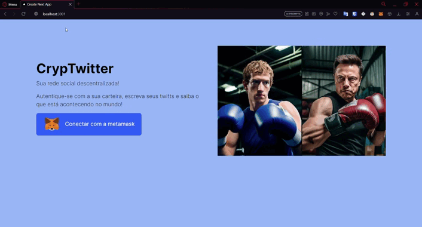

# 
🔗 Web3 Week #2 🔗

 

Projeto de uma rede social desentralizada simples, parecida com o Twitter, que autêntica com carteira digital e realiza transações com a Blockchain 🌐

 Aplicação web com Next.js e web3, conectando com a carteira MetaMask ⚛💻🦊

 

### Uma palinha da aplicação web:

  

### Instalação:
>Para baixar dependêncais:

    npm install

>para rodar a aplicação localmente:

    npm run dev   

 
Quer saber mais sobre Web3?

Acesse
    **www.luiztools.com.br**

